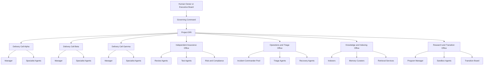
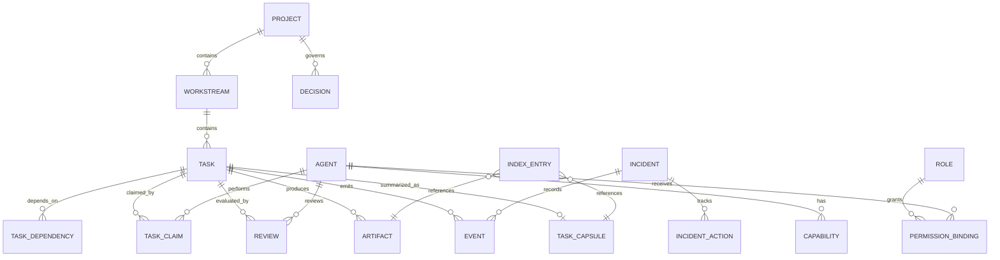
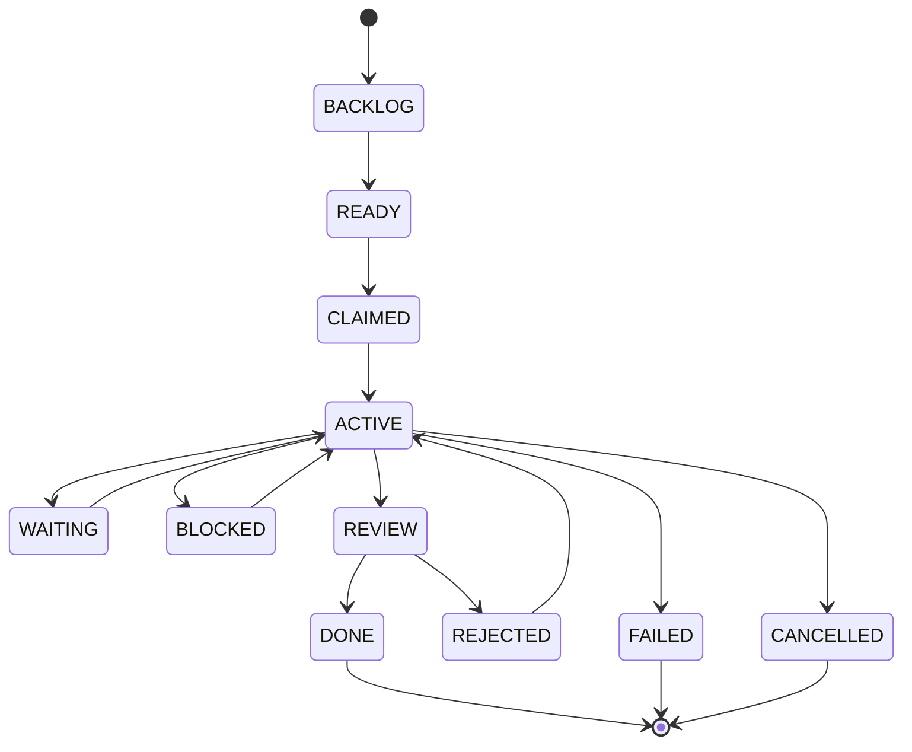
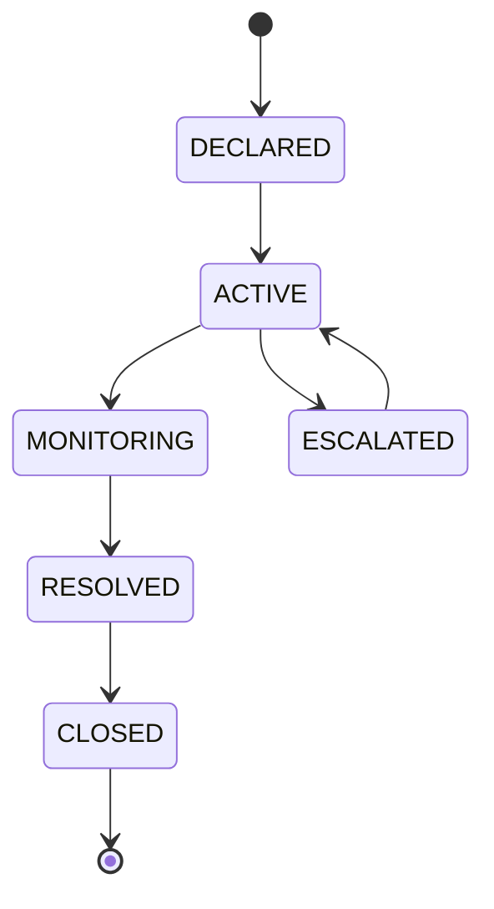
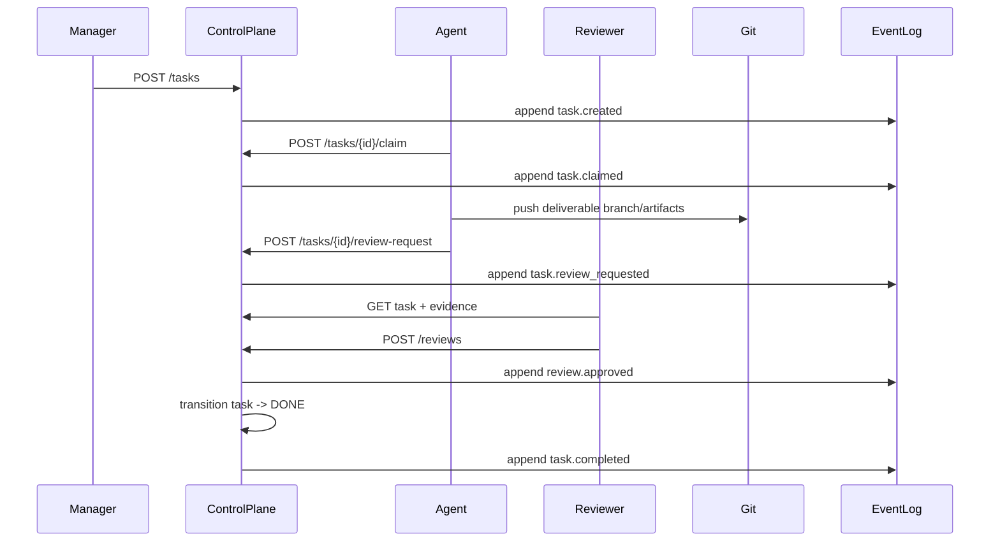
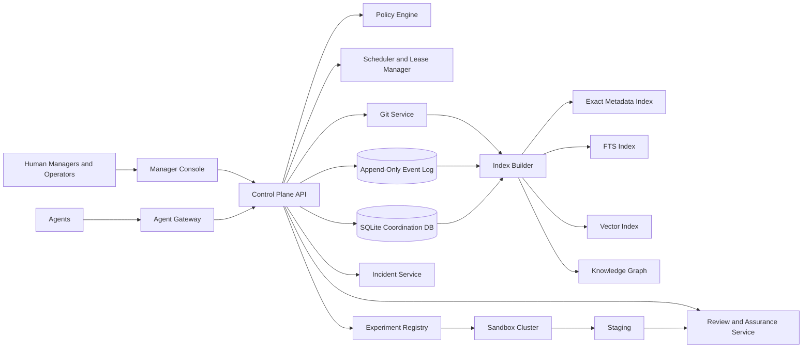
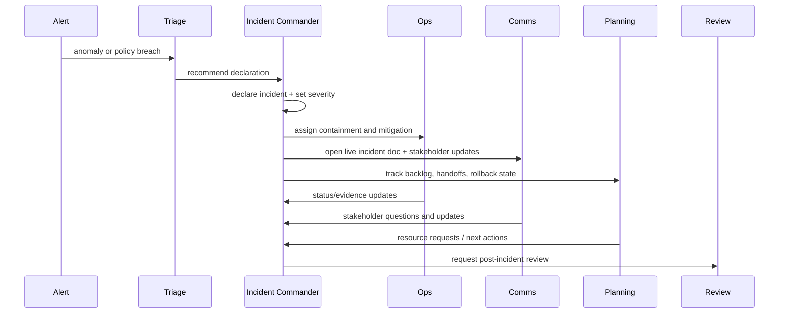
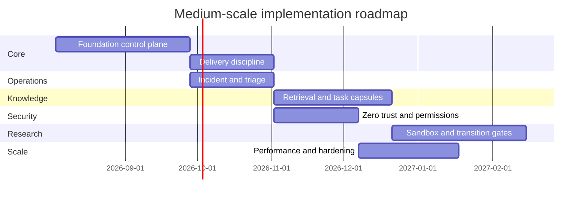

# Operational Blueprint for a Multi-Manager, Multi-Agent Management System

## Executive summary

The most robust model for a system with multiple managers and many human-plus-AI agents is not a loose matrix organization and not a single all-powerful orchestrator. It is a **federated control system** with two rules at its core: **shared strategic command** and **single operational ownership**. FEMA’s Incident Command System is the clearest real-world precedent: multiple authorities can operate under **Unified Command** with a common set of objectives and one plan, while each individual still reports to only one supervisor under **unity of command**. Google’s SRE practices add the operational machinery for incident command, living state documents, SLOs, and error budgets. NASA contributes the requirement for independent assurance and durable lessons learned. Toyota contributes stop-the-line quality control. NIST provides the governance, risk, zero-trust, and least-privilege foundation. DARPA contributes the right model for research programs, experimentation, and transition gates. citeturn1search2turn1search5turn1search17turn16view0turn7search2turn5search0turn5search1turn6search0turn3search15turn8search0turn4search1

For the specified persistence model, the recommended architecture is: **Git for canonical project meaning and artifact history**, **SQLite for the operational coordination plane**, and an **append-only event log** for replay, audit, and analytics. This combination fits a medium-scale deployment if writes are funneled through one authoritative control-plane service, because SQLite is strong on integrity, serializable transactions, and read-heavy workloads, but it still allows only one writer at a time; WAL mode improves concurrent reads and writes for this profile. Git is well suited to versioned artifacts and policy enforcement via hooks. citeturn10search6turn9search8turn19search1turn19search0turn19search4turn19search7

The resulting blueprint is a **control-plane architecture** in which managers set intent and allocate workstreams, agents work from bounded task packets, review and assurance are structurally independent from delivery, incidents temporarily shift authority to an incident commander, and research is isolated in a sandbox that cannot directly mutate production state. The central implementation recommendation is to treat the organization as an **operating system**, not as a chatroom: every meaningful action becomes a task, decision, review, event, or artifact with durable identifiers, permissions, and provenance. That is the practical way to keep a multi-manager, multi-agent system coherent when scale reaches tens of managers and hundreds of agents. citeturn1search8turn16view0turn17view0turn5search4turn15search0

## Assumptions and constraints

The blueprint below assumes a **medium-scale** environment: roughly **10s of managers**, **100s of agents**, mixed human and AI participation, and a need for operational reliability rather than purely experimental coordination. It assumes Git, SQLite, and an append-only event log are non-negotiable persistence primitives; it does **not** assume a specific programming language or cloud. It assumes consequential actions exist and therefore some actions must be gated for human approval. It also assumes the organization needs to handle both routine delivery and urgent incidents without inventing a separate operating model for each. These are design assumptions, not externally sourced facts. 

The design is constrained by the storage stack. SQLite supports many concurrent readers but only one writer at a time; in WAL mode, readers do not block writers and writers do not block readers, which makes it a good fit for a read-heavy control plane if write serialization is deliberate. Git stores history as snapshots and can trigger scripts at important lifecycle points through hooks, making it well suited for canonical artifacts, policy checks, and signed promotion paths. NIST’s security guidance implies that even in an internal agent system, identity, authorization, logging, and separation of duties must be treated as first-class controls, not afterthoughts. citeturn19search1turn19search0turn19search4turn10search6turn9search8turn8search0turn8search2turn20search9turn15search0

The governing design principles should therefore be explicit:

| Principle | Why it is necessary | Real-world source behind the principle |
|---|---|---|
| Shared strategic command, single operational owner | Prevents conflicting directives while preserving cross-domain leadership | FEMA Unified Command and unity of command citeturn1search2turn1search5turn1search17 |
| Manageable supervision spans | Avoids cognitive overload and hidden coordination failures | FEMA/NIMS span-of-control guidance gives 3–7, with 1:5 as the optimal rule of thumb citeturn0search1turn1search13turn1search8 |
| Independent assurance for important work | Delivery teams tend to miss their own blind spots | NASA IV&V and NASA software assurance policy citeturn5search0turn5search13turn5search20turn5search2 |
| Stop-the-line authority | Prevents bad outputs from propagating through dependent work | Toyota jidoka and line-stop practice citeturn6search0turn6search6 |
| Risk-based governance across the lifecycle | AI systems need governance, mapping, measurement, and management of risk | NIST AI RMF and Playbook citeturn3search15turn3search1turn3search7turn3search9turn3search13turn3search5 |
| Error-budget discipline | Balances innovation with reliability | Google SRE SLO and error-budget practice citeturn7search2turn7search5turn7search14turn7search8 |
| Research separated from production | High-risk exploration needs explicit program framing and transition gates | DARPA program-manager model and Heilmeier Catechism citeturn4search0turn4search1turn4search2turn4search5 |
| Durable lessons and reviewable records | Learning must survive the turnover of people and agents | NASA lessons-learned system and Gaussian postmortem practice at Google citeturn5search1turn5search4turn17view0turn18view1 |

The core organizational choice should be compared explicitly, because this is where many systems go wrong.

| Structural option | Benefits | Failure mode | Recommended use |
|---|---|---|---|
| Pure matrix with several active managers per task | Flexible on paper | Conflicting instructions, unclear accountability, hard postmortems | Do **not** use as the default |
| Single global manager | Simplicity | Bottleneck, hidden unilateral bias, poor domain depth | Only for very small systems |
| Unified command plus single task owner | Shared direction with clear execution responsibility | Requires disciplined record-keeping and escalation rules | **Recommended default** |
| Fully decentralized swarm | Fast local autonomy | Weak alignment, difficult auditing, weak safety control | Use only in sandboxes |

That recommendation is directly aligned with FEMA’s distinction between **Unified Command** and **unity of command**, and with Google’s incident doctrine that responsibilities must be clearly separated and delegated to named individuals. citeturn1search2turn1search5turn16view0

## Organizational structure and role model

The ideal operating model has six permanent functional domains: **Governing Command**, **Delivery Cells**, **Independent Assurance**, **Operations and Triage**, **Knowledge and Indexing**, and **Research and Transition**. Governing Command is where multiple managers jointly define objectives, priorities, risk tolerances, and resource allocation. Delivery Cells execute bounded work. Independent Assurance reviews delivery without being captured by delivery pressures. Operations and Triage handle incidents, handoffs, and system stress. Knowledge and Indexing maintain retrieval quality and long-term memory. Research and Transition convert uncertainty into controlled experiments and then into production-ready proposals. This structure mirrors the logic of FEMA’s functional separation, Google’s incident role separation, NASA’s IV&V independence, NASA’s reviewed lessons-learned system, and DARPA’s distinction between research programs and transition activities. citeturn1search8turn16view0turn5search13turn5search1turn5search4turn4search0turn4search2



The **Project DRI** is the key bridging role. Multiple managers are allowed at the strategic level, but a project or workstream still needs one directly responsible integrator who resolves collisions, owns the integrated plan, and decides which manager owns each task area. This mirrors the operational need in FEMA and Google to keep command and handoffs explicit, rather than allowing authority to remain ambiguous. citeturn1search20turn16view0

A practical responsibility map looks like this:

| Role | Primary responsibilities | Authority | Explicit limitations |
|---|---|---|---|
| Governing Command | Mission, priorities, budgets, risk tolerances, escalation policy | Can approve or reject strategic direction | Should not micromanage individual task execution |
| Project DRI | Integrated plan, cross-manager arbitration, dependency resolution | Can assign workstream ownership and integrate outputs | Should not self-review or bypass assurance |
| Domain Manager | Owns one workstream’s staffing, sequencing, and delivery quality | Can issue task packets within scope | Cannot overrule another domain’s formal decision without escalation |
| Task DRI | Executes one task packet and reports evidence | Can modify only permitted resources | Cannot redefine task objective silently |
| Assurance Reviewer | Reviews correctness, sufficiency, and risk | Can block promotion | Cannot review work they authored |
| Incident Commander | Directs incident response and handoffs | Can temporarily re-prioritize response work | Authority ends when incident closes |
| Research Program Manager | Frames hypotheses, milestones, evaluation, and transition | Can authorize sandbox experiments | Cannot ship directly to production |
| Knowledge Steward | Maintains memory, indexing, provenance, taxonomy | Can curate retrieval and retrospectives | Cannot change canonical facts without source-backed update |

For organizational load, the system should adopt FEMA’s span-of-control default: plan around roughly **five active direct reports or live work packages per manager**, and only stretch toward seven under controlled conditions. This is not because five is magical; it is because supervision cost rises sharply when a leader must simultaneously track objectives, status, risk, exceptions, and handoffs across too many independent threads. FEMA’s official guidance explicitly gives three to seven as effective and 1:5 as optimal. citeturn0search1turn1search13turn1search8

This role model also suggests the right template for work assignments. FEMA’s standardized ICS forms distinguish incident objectives, organization assignments, assignment lists, and organization charts. A multi-agent operating system should do the same by separating **task definition**, **organization assignment**, **authority**, and **evidence** rather than burying them all in an unstructured conversation. citeturn1search3turn1search18

## Data model, state machines, and APIs

A workable control plane needs at least five first-class records: **tasks**, **decisions**, **reviews**, **incidents**, and **events**. Around those, the system should maintain **artifacts**, **capabilities**, **permissions**, **task capsules**, and **index entries**. Git should hold the canonical text artifacts and structured records that define project meaning; SQLite should hold the current coordination state; the append-only event log should hold the full chronicle of what happened and when. That split is the best match to Git’s snapshot model, SQLite’s transactional coordination strengths, and NIST’s emphasis on durable log management and auditability. citeturn10search6turn19search7turn15search0turn15search5



A minimal SQL schema should look like this:

```sql
CREATE TABLE tasks (
  task_id TEXT PRIMARY KEY,
  project_id TEXT NOT NULL,
  workstream_id TEXT NOT NULL,
  title TEXT NOT NULL,
  objective TEXT NOT NULL,
  priority TEXT NOT NULL CHECK (priority IN ('P0','P1','P2','P3')),
  risk_level TEXT NOT NULL CHECK (risk_level IN ('R0','R1','R2','R3')),
  state TEXT NOT NULL CHECK (
    state IN ('BACKLOG','READY','CLAIMED','ACTIVE','WAITING','BLOCKED',
              'REVIEW','REJECTED','DONE','FAILED','CANCELLED')
  ),
  manager_id TEXT NOT NULL,
  task_dri_id TEXT,
  review_policy TEXT NOT NULL,
  scope_in TEXT,
  scope_out TEXT,
  acceptance_tests_json TEXT NOT NULL,
  permissions_profile TEXT NOT NULL,
  created_at TEXT NOT NULL,
  updated_at TEXT NOT NULL,
  due_at TEXT,
  version INTEGER NOT NULL DEFAULT 1
);

CREATE TABLE task_claims (
  claim_id TEXT PRIMARY KEY,
  task_id TEXT NOT NULL REFERENCES tasks(task_id),
  agent_id TEXT NOT NULL,
  lease_expires_at TEXT NOT NULL,
  status TEXT NOT NULL CHECK (status IN ('ACTIVE','EXPIRED','RELEASED','COMPLETED')),
  created_at TEXT NOT NULL
);

CREATE TABLE reviews (
  review_id TEXT PRIMARY KEY,
  task_id TEXT NOT NULL REFERENCES tasks(task_id),
  reviewer_id TEXT NOT NULL,
  disposition TEXT NOT NULL CHECK (disposition IN ('APPROVED','CHANGES_REQUIRED','REJECTED')),
  findings_json TEXT NOT NULL,
  created_at TEXT NOT NULL
);

CREATE TABLE decisions (
  decision_id TEXT PRIMARY KEY,
  project_id TEXT NOT NULL,
  title TEXT NOT NULL,
  status TEXT NOT NULL CHECK (status IN ('PROPOSED','ACCEPTED','SUPERSEDED','REJECTED')),
  owner_id TEXT NOT NULL,
  decision_json TEXT NOT NULL,
  created_at TEXT NOT NULL
);

CREATE TABLE incidents (
  incident_id TEXT PRIMARY KEY,
  severity TEXT NOT NULL CHECK (severity IN ('SEV0','SEV1','SEV2','SEV3')),
  status TEXT NOT NULL CHECK (status IN ('DECLARED','ACTIVE','MONITORING','RESOLVED','CLOSED')),
  commander_id TEXT NOT NULL,
  summary TEXT NOT NULL,
  impact_json TEXT NOT NULL,
  created_at TEXT NOT NULL,
  resolved_at TEXT
);

CREATE TABLE events (
  event_id TEXT PRIMARY KEY,
  sequence_no INTEGER NOT NULL UNIQUE,
  entity_type TEXT NOT NULL,
  entity_id TEXT NOT NULL,
  event_type TEXT NOT NULL,
  actor_id TEXT NOT NULL,
  occurred_at TEXT NOT NULL,
  payload_json TEXT NOT NULL,
  prev_hash TEXT,
  event_hash TEXT NOT NULL
);
```

The event log should be **append-only, versioned, and replayable**. NIST defines logs as records of events and treats log management as the process of generating, storing, accessing, and disposing of such data; it also emphasizes that logs support both incident investigation and operational analysis. For this reason, operational truth should not depend only on mutable task rows. Current state belongs in SQLite, but history belongs in immutable events. citeturn15search0turn15search2turn15search9

A strongly typed event envelope is therefore essential:

```json
{
  "event_id": "evt_000001923",
  "sequence_no": 1923,
  "schema_version": 1,
  "entity_type": "task",
  "entity_id": "task_0241",
  "event_type": "task.review_requested",
  "actor": {
    "actor_type": "agent",
    "actor_id": "agent_index_01",
    "run_id": "run_88431"
  },
  "occurred_at": "2026-07-21T14:19:22Z",
  "correlation_id": "corr_77af",
  "causation_id": "evt_000001918",
  "payload": {
    "from_state": "ACTIVE",
    "to_state": "REVIEW",
    "artifacts": ["artifact_188", "artifact_189"],
    "evidence": ["test_report_54"]
  },
  "prev_hash": "sha256:...",
  "event_hash": "sha256:..."
}
```

Task state must be explicit and machine-enforced. Google’s incident practice shows why living state matters: when state is vague, people freelance, duplicate work, or act against one another. citeturn16view0



Incident state needs a separate machine because incidents are not normal tasks. Google’s incident guide emphasizes early declaration, explicit command, a recognized command post, a living incident document, and clear handoff. citeturn16view0



A task packet should be concrete enough that an agent can act without improvising its mission:

```yaml
task_id: task_0241
project_id: proj_opsys
workstream_id: ws_indexing
title: Build search index over task capsules
objective: |
  Implement a derived search index over accepted task capsules so that
  agents can retrieve prior decisions, patterns, and unresolved questions.
why_it_matters: |
  Current retrieval relies too heavily on raw archives and is too slow for review workflows.
scope_in:
  - Create schema migration for index tables
  - Build exact-match and full-text indexing pipeline
  - Add tests and benchmark report
scope_out:
  - No vector retrieval in this task
  - No production cutover
constraints:
  - Canonical task capsules remain source of truth
  - Index is fully rebuildable from canonical records
  - No direct writes to unrelated project files
inputs:
  - decision_0048
  - artifact_capsule_schema_v3
acceptance_tests:
  - Full rebuild completes under 15 minutes on staging dataset
  - Search returns known capsule IDs in exact-match test cases
  - Rebuild from scratch matches incremental output
permissions_profile: profile_indexing_r1
review_policy: independent-review-required
escalate_if:
  - schema conflict with task capsule source
  - rebuild latency exceeds budget by >20%
deliverables:
  - migration.sql
  - indexer artifact
  - benchmark.json
  - docs/update_indexing.md
```

A decision record should make disagreement survivable:

```yaml
decision_id: decision_0048
title: Choose layered retrieval over vector-only retrieval
status: ACCEPTED
owner_id: proj_dri_01
date: 2026-07-21
context: |
  Agents need low-latency, high-provenance access to prior work.
options:
  - vector_only
  - exact_plus_fts_plus_capsule_plus_vector
decision: exact_plus_fts_plus_capsule_plus_vector
rationale:
  - higher precision for policy and identifier lookups
  - easier provenance and debugging
  - vector retained for recall, not authority
dissent:
  manager_research_02: |
    Vector-only is simpler to prototype; revisit if indexing maintenance cost is excessive.
revisit_triggers:
  - retrieval_p95_ms > 500
  - accepted_search_precision < 0.9
```

A small but realistic API surface is enough to implement the control plane:

| Endpoint | Method | Purpose |
|---|---|---|
| `/api/v1/tasks` | POST | Create task |
| `/api/v1/tasks/{task_id}` | GET | Read current task state |
| `/api/v1/tasks/{task_id}/claim` | POST | Acquire lease-based claim |
| `/api/v1/tasks/{task_id}/events` | POST | Append task event |
| `/api/v1/tasks/{task_id}/review-request` | POST | Move task to review |
| `/api/v1/reviews` | POST | Submit independent review |
| `/api/v1/decisions` | POST | Create or update decision record |
| `/api/v1/incidents` | POST | Declare incident |
| `/api/v1/incidents/{incident_id}/handoff` | POST | Explicit command handoff |
| `/api/v1/search` | GET | Layered retrieval API |
| `/api/v1/experiments` | POST | Register R&D experiment |
| `/api/v1/transitions/{experiment_id}/promote` | POST | Request production transition |

Example request and response:

```http
POST /api/v1/tasks/task_0241/claim
Content-Type: application/json

{
  "agent_id": "agent_index_01",
  "lease_seconds": 1800,
  "expected_version": 7
}
```

```json
{
  "claim_id": "claim_9812",
  "task_id": "task_0241",
  "status": "ACTIVE",
  "lease_expires_at": "2026-07-21T15:00:00Z",
  "task_state": "CLAIMED"
}
```



## Platform architecture, indexing, security, and R&D transition

At medium scale, deployment should be centered on a **single authoritative control-plane service** that owns all writes to SQLite and the append-only event log. Agents and managers should not write SQLite directly. This is the simplest way to respect SQLite’s one-writer model while still benefiting from its serializable transactions and WAL concurrency. Reads can fan out across API replicas, cache layers, and read-only retrieval services; writes should funnel through one control-plane authority or a tightly coordinated HA pair with leader election. citeturn19search1turn19search0turn19search4turn19search12



The retrieval architecture should be **layered**, not vector-first. NIST AI RMF repeatedly emphasizes documenting assumptions, metrics, test procedures, lineage, and independent corroboration. A vector-only retrieval path is poor at exact policy lookup, provenance, and deterministic debugging. The better architecture is a staged retrieval pipeline: **project/workstream filter**, **exact ID and metadata match**, **decision and requirement lookup**, **full-text search**, **task capsules**, **semantic/vector recall**, and only then **raw archive access** if needed. NASA’s lessons-learned model also supports this: curated, reviewed lessons are more reusable than unbounded raw archives. citeturn3search9turn3search13turn3search7turn5search1turn5search4

A recommended retrieval stack:

| Retrieval layer | Purpose | Source of truth |
|---|---|---|
| Metadata index | IDs, tags, statuses, owners, projects | SQLite + canonical records |
| Full-text index | Exact phrase and policy text retrieval | Git canonical docs + accepted artifacts |
| Task capsules | Compact reusable summaries | Derived from accepted tasks |
| Vector index | Similarity recall | Derived, never authoritative |
| Knowledge graph | Dependencies, references, repeated patterns | Derived from events/records |

This is the right tradeoff because it preserves retrieval **precision** for policy and identifiers while keeping vector search for **recall**. Vector-only systems are attractive because they look simple, but they fail exactly where management systems most need determinism: permissions, provenance, dependency checks, and post-incident forensics. That conclusion is an engineering inference based on NIST’s focus on measurement and documentation, NASA’s emphasis on reviewed lessons, and the log-centric operational practices in Google SRE. citeturn3search13turn3search9turn5search4turn15search0turn17view0

Security should follow **zero trust**, **least privilege**, and **separation of duties**. NIST defines zero trust as eliminating implicit trust and requiring continuous verification; it defines least privilege as restricting access to the minimum necessary; and its separation-of-duty guidance warns against giving one principal enough power to misuse the system alone. In practice, this means every agent run gets a short-lived capability token tied to one task, one permissions profile, one timebox, and one environment. Write permissions should be scoped to specific Git paths, artifact stores, or API actions rather than broad repository access. Reviewers should not inherit the same credentials as producers. Incident authority should be temporary and explicit. citeturn8search13turn8search0turn8search2turn20search9

A practical permission model can be expressed as a hybrid of RBAC and task-scoped capability grants:

```yaml
role_profiles:
  manager_delivery:
    can:
      - create_task
      - assign_workstream
      - request_review
    cannot:
      - approve_own_high_risk_change

  agent_indexing_r1:
    can:
      - read_project:proj_opsys
      - write_git_paths:/indexes/**
      - post_event
      - upload_artifact
    cannot:
      - modify_permissions
      - close_incident
      - promote_experiment

  reviewer_independent:
    can:
      - read_task_evidence
      - submit_review
      - block_promotion
    cannot:
      - author_production_change
```

For the event log, the design should follow NIST log-management guidance: standardized schemas, time synchronization, explicit retention, and protected integrity. At minimum, the event service should enforce sequence numbers, hashes, schema versions, actor identity, correlation IDs, and immutable append semantics. A mutable operational table can tell you what is true **now**; only the event log can tell you **how it became true**. That distinction matters for audits, disputes, repeated failures, and scientific evaluation of process changes. citeturn15search0turn15search5turn15search12

Research and development should be **sandboxed by default**. DARPA’s program-manager model and Heilmeier Catechism both assume that research is hypothesis-driven, milestone-driven, and transition-conscious. NIST AI RMF’s Playbook similarly stresses documenting assumptions, metrics, data lineage, and evaluator independence. Therefore, experiments should run in isolated sandboxes with read-only access to approved source datasets, no direct write path to production state, controlled egress, and explicit experiment registries. Promotion out of the sandbox should require: a program record, a hypothesis, baseline metrics, a defined evaluation dataset, an assurance review, rollback criteria, and a named transition owner. citeturn4search1turn4search0turn4search2turn4search5turn3search9turn3search13turn3search5

A good experiment record looks like this:

```yaml
experiment_id: exp_0038
program_manager: mgr_research_01
title: Constraint-aware retrieval assembly
question: |
  Does injecting decision and policy records before semantic recall reduce review failure?
hypothesis: |
  Review rejection rate will drop by at least 20 percent without increasing median retrieval latency above 15 percent.
baseline:
  review_rejection_rate: 0.22
  retrieval_p50_ms: 180
success_metrics:
  - review_rejection_rate
  - retrieval_p50_ms
  - missing-constraint defects
dataset:
  train: staging_june_snapshot
  eval: accepted_tasks_q2
safety_constraints:
  - no production writes
  - no live customer data egress
kill_conditions:
  - latency increase > 25 percent
  - precision below baseline
transition_owner: proj_dri_01
```

Transition should then follow the pattern **sandbox → staging → canary → limited production → full production**, with each stage producing evidence, not only intent. That staging discipline is consistent with Google’s reliability practice, NASA’s assurance posture, DARPA’s transition emphasis, and Toyota’s preference for detecting abnormalities before propagating them downstream. citeturn7search14turn7search2turn5search0turn4search2turn6search0

## Assurance, incident command, and governance

The assurance model should have four layers. First, the producing agent performs self-checks against schema, tests, and policy. Second, an **independent reviewer** verifies correctness, sufficiency, and compliance. Third, a **validation layer** confirms that the produced result is the right result for the objective, not just a syntactically correct artifact. Fourth, **human approval** gates irreversible, public, financial, legal, security-sensitive, or conflict-ridden changes. NASA’s IV&V exists precisely because important systems need independent evidence-based assurance, not only developer confidence. NIST’s AI RMF similarly insists on appropriate measurement, documentation, and risk handling across the lifecycle. citeturn5search0turn5search13turn5search20turn3search15turn3search13turn3search5

A practical risk tiering model is:

| Risk tier | Example | Required assurance |
|---|---|---|
| R0 | Internal note, reversible search/index refresh | Self-check only |
| R1 | Reversible code/doc/config change in assigned area | Independent review |
| R2 | Cross-workstream architecture change, migration, model/policy change | Independent review plus assurance sign-off |
| R3 | Irreversible, public, security-critical, destructive, or legally sensitive action | Assurance sign-off plus human approval |

This tiering is the operational translation of NASA IV&V’s independence and NIST’s risk-governance approach into a medium-scale agent system. citeturn5search0turn3search15turn8search4

Incidents should be declared early. Google’s official SRE guidance says it is better to declare an incident early and then close it quickly than to wait while the problem grows. Google also defines four key roles: **Incident Commander**, **Ops lead**, **Communications lead**, and **Planning lead**; it requires a recognized command post, a living incident document, and explicit handoff of command. NIST’s incident definition is broader than pure outages and includes events that jeopardize confidentiality, integrity, or availability, which is useful when AI agents can fail through bad automation, permissions misuse, or corrupted state rather than only service downtime. citeturn16view0turn14search2



A live incident document should follow the structure Google publishes in its example incident document: summary, status, command hierarchy, command post, exit criteria, TODOs, and timestamped timeline. That example is valuable because it demonstrates that an incident record is not an essay; it is a tool for coordination under stress. citeturn18view0

A corresponding postmortem should follow Google’s example postmortem and Google’s broader postmortem culture guidance: summary, impact, root cause, trigger, resolution, detection, action items, lessons learned, and timeline, all written blamelessly and backed by data. Google explicitly argues that well-written, acted-on, widely shared postmortems reduce repeat outages, and that leadership must model blameless behavior. citeturn18view1turn17view0

A production-ready postmortem template:

```yaml
incident_id: inc_0465
title: Retrieval pipeline returned stale policy records
date_opened: 2026-07-21T13:10:00Z
date_closed: 2026-07-21T14:02:00Z
severity: SEV1
authors:
  - ic_01
  - reviewer_03
status: COMPLETE

summary: |
  Retrieval service served stale policy documents for 52 minutes after a failed index refresh.
impact:
  users_affected: internal agents and managers on project proj_opsys
  degraded_functions:
    - review preparation
    - decision lookup
  quantitative:
    failed_reviews: 14
    wrong-policy retrievals: 93
root_cause: |
  Incremental index refresh accepted an out-of-order event batch and marked the newer snapshot complete.
trigger: |
  Retry after partial event-log lag produced a stale completeness signal.
detection: |
  Review agent flagged policy-version mismatch; dashboard burn-rate alert also fired.
resolution: |
  Rebuilt index from canonical task capsules and invalidated stale cache.
what_went_well:
  - mismatch detected by independent review
  - rebuild playbook existed
what_went_wrong:
  - completeness check used wall-clock order, not sequence order
  - alerting threshold was too slow
where_we_got_lucky:
  - stale record had visible version header
action_items:
  - id: ai_1
    type: prevent
    owner: mgr_indexing_01
    due: 2026-07-28
    description: enforce monotonic event sequence requirement
  - id: ai_2
    type: detect
    owner: sre_ops_01
    due: 2026-07-24
    description: add stale-policy burn alert
timeline:
  - "13:10 alert fired on review mismatch"
  - "13:14 incident declared"
  - "13:26 stale shard identified"
  - "13:41 rebuild completed"
  - "14:02 incident resolved"
```

Disagreement among managers needs a formal protocol because informal consensus fails under time pressure. The recommended decision protocol is: **domain owner decides within scope; affected managers file objections with evidence; Project DRI arbitrates if cross-domain; Governing Command decides if strategic; human owner decides if irreversible or outside charter; the decision and dissent are then recorded**. FEMA’s command doctrine supports explicit command structures and transfer of command; NIST AI RMF supports documented risk tolerances and governance; NASA’s lessons-learned practice shows why even dissenting rationale should be preserved for future review. citeturn1search20turn1search17turn3search7turn3search5turn5search1turn5search4

Reliability should be managed through **SLOs and error budgets**, adapted from Google SRE. Google defines the error budget as **1 minus the SLO**, and treats it as the mechanism for balancing innovation with reliability. It also recommends explicit error-budget policy, burn-rate alerting, and temporary freezes when the budget is exhausted. In this blueprint, the same logic applies beyond user-facing uptime to task acceptance quality, review rejection rates, incident recurrence, and stale retrieval defects. citeturn7search2turn7search5turn7search8turn7search14

An illustrative internal reliability budget:

| Objective | SLI | Target | Budget policy if exhausted |
|---|---|---|---|
| Task acceptance quality | `% tasks accepted without rework` | 90% | Pause new workflow variants in affected workstream |
| Incident recurrence | `repeat SEV1/SEV0 incidents per quarter` | 0 | Freeze risky changes until corrective actions close |
| Retrieval correctness | `policy/decision retrieval precision` | 99% | Disable experimental retrieval paths |
| Review latency | `median time review-ready → disposition` | < 8 hours | Divert capacity from features to assurance |

## Roadmap, estimates, and implementation checklist

The most reliable way to implement this system is in phases. A medium-scale organization should not attempt the full blueprint in one step, because doing so creates an impressive-looking bureaucracy before the control plane is stable. The roadmap below assumes a core implementation team of roughly **3–5 platform engineers**, **1 product/program owner**, **part-time security/reliability support**, and access to domain leads for requirements. These effort numbers are estimates for planning, not sourced facts.

| Phase | Estimated effort | Main outputs | Main risks |
|---|---:|---|---|
| Foundation | 6–8 weeks | Control-plane API, task model, leases, Git integration, SQLite schema, event envelope | Overdesign before field use |
| Delivery discipline | 4–6 weeks | Task packets, review flow, decision records, basic dashboards | Users bypass system for “faster” side channels |
| Incident and triage | 4–6 weeks | Incident service, live incident doc, role handoffs, postmortems | Role confusion during first real incident |
| Knowledge and retrieval | 6–8 weeks | Task capsules, FTS, metadata search, provenance UI | Vector-first temptation, weak curation |
| Security hardening | 4–6 weeks | Zero-trust gateway, task-scoped tokens, policy engine, audit controls | Excessive friction from over-strict permissions |
| R&D sandbox and transition | 6–10 weeks | Experiment registry, sandbox cluster, transition board, canary flow | Research bypasses transition discipline |
| Scale and optimization | 4–8 weeks | Queueing, caching, archive compaction, advanced dashboards | SQLite write bottlenecks if write path is not centralized |



The dashboard layer should be minimal at first but deliberate. Google’s SRE material emphasizes that reliability work needs measurable signals; NIST stresses measurement and documentation; NASA’s reviewed lessons imply that metrics should support learning, not only surveillance. The recommended dashboard families are therefore: **Flow** (task throughput, blocked age, lease expiry), **Quality** (review rejection, rework rate, post-release defects), **Reliability** (error budget burn, incident count, mean time to mitigate), **Knowledge** (capsule coverage, retrieval precision, provenance completeness), and **Security** (denied actions, token expiration failures, policy exceptions). citeturn7search8turn7search2turn3search13turn5search1turn15search0

A useful implementation checklist, ordered by priority, is:

| Priority | Checklist item | Why first |
|---|---|---|
| Highest | Define task, decision, review, incident, and event schemas | Everything else depends on these records |
| Highest | Centralize all writes behind one control-plane API | Required by the SQLite concurrency model and for auditability |
| Highest | Implement lease-based task claiming and explicit state transitions | Prevents duplicate or orphaned work |
| Highest | Stand up independent review flow | Prevents producer-only quality control |
| High | Create live incident document template and handoff process | Needed before the first serious incident |
| High | Define risk tiers and human approval gates | Prevents unsafe automation |
| High | Build exact-match and full-text retrieval before vector search | Highest value and easiest to debug |
| High | Create task capsule generation on acceptance | Makes long-term memory usable |
| Medium | Add vector recall and knowledge-graph edges | Improves recall after precision path is stable |
| Medium | Add experiment registry and sandbox cluster | Enables safe R&D |
| Medium | Add promotion board and canary automation | Prevents research from bypassing production safety |
| Later | Add cross-project federation and database migration path | Only needed when scale exceeds SQLite’s comfortable write profile |

The main risks to watch are not primarily technical. The deepest risks are organizational: hidden matrix authority, informal side-channel work, reviewers who are not genuinely independent, sandboxes that mutate production by accident, and dashboards that track activity rather than outcomes. The reason the blueprint leans so heavily on FEMA, Google SRE, NASA, Toyota, NIST, and DARPA is that each of those systems solved one part of the same problem: **how to preserve clarity, safety, learning, and speed when many capable actors are operating at once**. citeturn1search2turn16view0turn5search0turn6search0turn3search15turn4search1

The shortest correct summary of the implementation target is this: build a **unified-command organization with single-owner tasks, independent assurance, explicit incidents, durable records, layered retrieval, risk-based permissions, and sandboxed research with gated promotion**. That is the operational blueprint most consistent with the named real-world systems and most likely to remain governable as the number of managers and agents grows. citeturn1search17turn16view0turn5search4turn7search2turn3search5turn8search13turn4search2