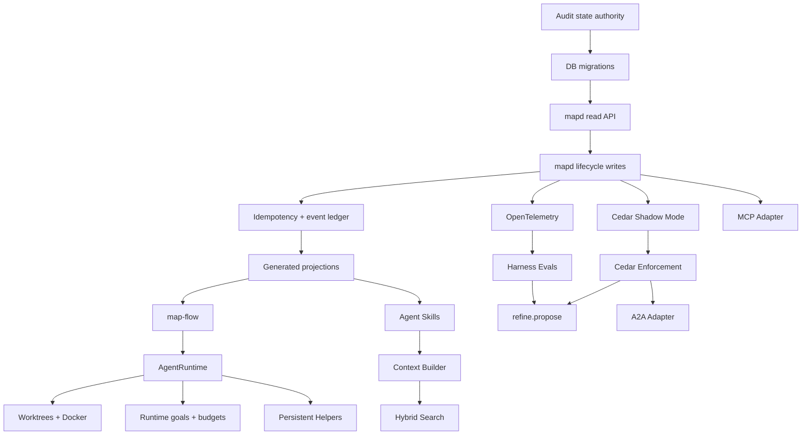

# MAP Deep-Dive Implementation Package

## Executive summary

I converted the research into a **repo-ready implementation package**, rather than a conceptual recommendation list. The package lays out how to evolve MAP from its current file-first/SQLite/LangGraph architecture into a more durable control plane built around a trusted `mapd` authority service, typed APIs, transactional events, generated projections, deterministic workflows, provider-neutral agent runtimes, isolated workspaces, governed persistent helpers, better context/search, policy-as-code, OpenTelemetry tracing, harness evaluations, and controlled self-improvement.

The plan deliberately **builds on MAP rather than replacing it**. MAP already has strong foundations: SQLite-backed atomic claims and leases, LangGraph routing, a checkpointed `agent_loop`, HPOM authority tiers, Research and Emergence systems, bounded context packets, hcom communication, independent review, validation/repair scripts, durable handoffs/artifacts, Command Center, and CLI surfaces. fileciteturn10file0L1-L2 fileciteturn11file0L1-L2 fileciteturn12file0L1-L2 fileciteturn7file0L1-L2

The central architectural recommendation is to eliminate ambiguity about runtime state:

```text
Human-authored project intent
        │
        ▼
task specs / decisions / policies
        │
        ▼
      mapd
 trusted Host API
        │
        ├── authorization
        ├── idempotency
        ├── optimistic versions
        ├── lifecycle rules
        └── transactional events
        │
        ▼
     SQLite
canonical mutable runtime state
        │
        ▼
 generated projections
 task JSON / graph / status / JSONL / UI
```

That conclusion is reinforced by MAP's current implementation. The claim layer already centralizes significant guarded lifecycle logic, while `agent_loop.py` performs task claiming, lease heartbeats, handler execution, retries, and submission around LangGraph. The present submission path also shows why the next step matters: the SQLite lifecycle change can succeed before the JSONL event append occurs, leaving a recoverable but real synchronization window. fileciteturn10file0L1-L2 fileciteturn11file0L1-L2

## Downloadable implementation package

The easiest artifact to give MAP is the complete ZIP:

**[Download the full MAP 2.0 implementation package](sandbox:/mnt/data/MAP_2_Implementation_Package.zip)**

For an agent that works better from one large specification:

**[Download the combined implementation brief](sandbox:/mnt/data/MAP_2_Implementation_Package/MAP_2_IMPLEMENTATION_PACKAGE_COMBINED.md)**

The package is also divided into focused files so MAP can ingest only the relevant implementation context:

| File | Purpose |
|---|---|
| **[README.md](sandbox:/mnt/data/MAP_2_Implementation_Package/README.md)** | Package index and recommended reading order |
| **[MAP_2_IMPLEMENTATION_MASTER_PLAN.md](sandbox:/mnt/data/MAP_2_Implementation_Package/MAP_2_IMPLEMENTATION_MASTER_PLAN.md)** | Executive summary, current MAP inventory, assumptions, target architecture, priorities, migration phases, milestones, and risks |
| **[MAP_2_RUNTIME_AUTHORITY_DATA_SPEC.md](sandbox:/mnt/data/MAP_2_Implementation_Package/MAP_2_RUNTIME_AUTHORITY_DATA_SPEC.md)** | `mapd`, JSON-RPC Host API, canonical state, event ledger, SQLite schema migrations, runtime goals, `AgentRuntime`, workspaces, persistent helpers, LangGraph/Temporal boundary |
| **[MAP_2_WORKFLOWS_CONTEXT_SECURITY_INTEROP.md](sandbox:/mnt/data/MAP_2_Implementation_Package/MAP_2_WORKFLOWS_CONTEXT_SECURITY_INTEROP.md)** | `map-flow`, Lobster-style YAML, Agent Skills, Context Builder, FTS5 + semantic search, Cedar authorization, budgets/circuit breakers, MCP and A2A |
| **[MAP_2_OBSERVABILITY_EVAL_REFINEMENT.md](sandbox:/mnt/data/MAP_2_Implementation_Package/MAP_2_OBSERVABILITY_EVAL_REFINEMENT.md)** | OpenTelemetry traces/metrics, historical harness regression suite, `refine.propose`, governance, rollback, Command Center observability |
| **[MAP_2_COMPARISONS_AND_SOURCES.md](sandbox:/mnt/data/MAP_2_Implementation_Package/MAP_2_COMPARISONS_AND_SOURCES.md)** | Temporal vs LangGraph, Lobster vs custom flow engine, worktree/container/microVM isolation, Prime/Codex/Claude/OpenHands adapters, 34-task implementation backlog, primary-source links |

The Markdown files contain Mermaid diagrams, SQL DDL, JSON-RPC examples, JSON schemas, YAML workflow examples, CLI designs, Cedar-style policy sketches, testing requirements, migration sequences, task seeds, and primary-source links.

## What the implementation plan actually proposes

The package recommends **not** starting with Prime Agent, A2A, MCP, or self-improvement. Instead, it builds the foundation those features need.

### The first architectural move is `mapd`

`mapd` becomes a local trusted service, preferably exposed through a Unix-domain socket rather than a network port. Agents, the CLI, Command Center, workflows, MCP, A2A, and future runtimes request operations through it rather than modifying canonical runtime state independently.

A representative request becomes:

```json
{
  "jsonrpc": "2.0",
  "id": "req-72",
  "method": "task.claim",
  "params": {
    "task_id": "TASK-400",
    "lease_seconds": 1800
  },
  "meta": {
    "actor_id": "codex-lab-kiri",
    "session_id": "SES-01J...",
    "idempotency_key": "codex:TASK-400:claim:2",
    "expected_version": 12,
    "traceparent": "00-..."
  }
}
```

The critical additions are **actor identity, idempotency, optimistic versions, authorization, correlation and trace IDs**. A caller retrying after a crash should receive the original result rather than accidentally performing the action twice.

This is an evolutionary refactor because MAP's existing `db/claims.py` already contains much of the correct guarded lifecycle logic, including acceptance-criteria checks, output-path checks, self-review protection, leases, heartbeats, submission authorship, orphan recovery, and owner reassignment. fileciteturn10file0L1-L2

### SQLite becomes the sole mutable runtime authority

The package distinguishes three forms of information:

| Type | Examples | Authoritative writer |
|---|---|---|
| Human-authored specification | task intent, acceptance criteria, decisions, HPOM policy | reviewed MAP files |
| Mutable runtime state | claim, lease, status, session, goal, review claimant, approval, budget, flow run | `mapd` → SQLite |
| Generated view | task lifecycle JSON, task graph, agent status, JSONL event export, active lanes | projection worker |

This removes the need to ask whether SQLite, `TASK-NNN.json`, `task_graph.json`, or a generated status block is “more current.” The runtime values have one answer.

The plan specifically recommends splitting the current task representation into:

```text
tasks/specs/TASK-400.json
    human-readable canonical intent

tasks/TASK-400.json
    generated compatibility/composite view
```

during migration rather than breaking existing consumers immediately.

The Context System already follows a closely related principle for knowledge: it distinguishes bounded Required/Optional/Excluded context from indiscriminate loading and explicitly treats stale/conflicting context as a problem rather than something an agent should silently resolve. fileciteturn13file0L1-L2

### Events become transactional

Instead of:

```text
update SQLite
    ↓
commit
    ↓
append JSONL
    ↓
insert/copy event elsewhere
```

the proposed model is:

```text
BEGIN

update lifecycle state
append canonical event row
record command result

COMMIT
        ↓
Projection Worker
        ↓
events/events.jsonl
```

Therefore, losing the projection process cannot lose the actual event. `events/events.jsonl` can be regenerated from the event ledger.

The proposed event shape includes:

```text
event_id
aggregate_type
aggregate_id
aggregate_seq
event_type
actor_id
actor_session_id
causation_id
correlation_id
trace_id
payload
created_at
```

### `agent_loop.py` gets decomposed rather than discarded

Current `agent_loop.py` already uses LangGraph, locks one loop per agent/database pair, expires leases, polls routing state, claims work, supervises a handler with heartbeats, retries failed work, submits tasks, and interrupts for operator-required routes. fileciteturn11file0L1-L2

The target decomposition is:

```text
                     mapd
                       │
          ┌────────────┼─────────────┐
          ▼            ▼             ▼
   RuntimeSupervisor  Executor    Host API
          │
          ▼
     AgentRuntime
          │
   ┌──────┼─────────┬─────────┐
   ▼      ▼         ▼         ▼
Claude  Codex     Prime   OpenHands
```

This avoids having terminal/session orchestration, MAP lifecycle ownership, provider invocation, heartbeat management and durable workflow logic all live in one loop.

Prime Agent provides particularly strong evidence for separating the terminal UI from the actual running session: its daemon owns live sessions over a local socket, supports detach/reattach, persists session history to append-only JSONL, recovers worker processes from stored state, and retains persistent subagents. citeturn18view0

### Runtime goals are separated from MAP tasks

The package adopts Prime Agent's useful distinction between a long-lived objective and the continuation mechanism. Prime Agent supports persistent goals, autonomous continuation, verification gates, and turn/token/time bounds. citeturn18view0

MAP's version becomes:

```text
MAP Task
    = project outcome and acceptance contract

Runtime Goal
    = this particular session's obligation

Completion Gate
    = deterministic evidence required before stopping

Budget
    = how much autonomy this attempt receives
```

So:

```text
Agent: "I think I'm done."
          │
          ▼
COMPLETION_PENDING
          │
          ▼
deterministic verification
     ┌────┴────┐
     │         │
    pass      fail
     │         │
 COMPLETE   continue
```

A runtime goal carries maximum turns, token allowance, wall-clock duration, helper count, retry budget, and verification gate.

### Routine procedures become `map-flow`

The package treats model reasoning as expensive and inappropriate for already-decided procedures.

Lobster is a strong reference here because it provides typed JSON-first pipelines, deterministic steps, approval gates, conditional execution, retries, timeouts, resumability and Mermaid/DOT/ASCII workflow visualization. citeturn17search0turn17search13

Rather than immediately making Lobster's Node runtime mandatory, the recommendation is a small Python-native MAP workflow executor with Lobster-like semantics:

```yaml
name: task-release

steps:
  - id: load_task
    map_call: task.get

  - id: verify_review
    map_call: review.get

  - id: run_release_checks
    command: python3 MAP_System/scripts/run_tests.sh
    timeout_seconds: 1800

  - id: operator_gate
    approval:
      when: high-risk

  - id: release
    map_call: task.release

  - id: rebuild_views
    map_call: projection.rebuild
```

Mechanical work stays deterministic. An `agent:` step exists only where judgment actually matters.

### Each coding task gets an isolated workspace

Git officially supports multiple linked worktrees with independent working-tree state, which makes it a lightweight way to keep concurrent branches from sharing one mutable checkout. citeturn20search0

The package recommends:

```text
LOW risk
    → dedicated Git worktree

MEDIUM risk
    → worktree + Docker

HIGH risk
    → hardened worktree + Docker

future UNTRUSTED execution
    → microVM / remote sandbox
```

OpenHands explicitly treats sandboxing as necessary for security, consistency, resource control, isolation and reproducibility, and recommends its Docker sandbox for local operation. Its workspace API also provides a useful example of abstracting local, Docker and remote execution behind one interface. citeturn21search0turn21search1turn21search17

Firecracker is retained as a future high-isolation option rather than an immediate MAP dependency; its microVM model uses KVM hardware virtualization and is explicitly designed around strong multi-tenant isolation with a minimal virtual-machine surface. citeturn20search7

### Agent Skills replace standing procedural context

The package proposes canonical MAP skills such as:

```text
skills/
  map-task/
  map-review/
  map-release/
  map-context/
  map-research/
  map-repair/
```

The Agent Skills specification makes `SKILL.md` the required core, allows scripts/references/assets, and uses progressive disclosure: metadata is cheap and always available, full instructions load only when the skill activates, and additional resources load on demand. citeturn15search0turn15search2

That fits MAP particularly well because its current Context System already says the right conceptual thing: give an agent a bounded context packet, not everything that might possibly be relevant. fileciteturn13file0L1-L2

### The Context System becomes executable

The proposed Context Builder does not replace `CONTEXT_SYSTEM.md`; it mechanizes it.

```text
task
 +
explicit input paths
 +
current governance
 +
applicable decisions
 +
verified research
 +
recent relevant events
 +
hybrid search
        │
        ▼
canonicality/freshness checks
        │
        ▼
token budget
        │
        ▼
Context Packet
```

Each packet records:

```text
Required
Optional
Excluded
why each item was selected
authority/canonicality
content hash
freshness
retrieval query
token estimate
warnings
```

Search begins with SQLite FTS5 and adds semantic reranking without immediately introducing another database. Exact task inputs and canonical documents are ranked by policy before semantic similarity, preventing an obsolete but semantically similar artifact from outranking a current decision.

### Cedar-style policy becomes the real authority barrier

Cedar's authorization model asks whether a **principal** can perform an **action** on a **resource**, with request-specific **context**, and its current documentation explicitly describes patterns for AI/software agents acting on behalf of users. citeturn16search1turn16search3

That maps closely to MAP:

```text
principal:
  helper-security-17

action:
  WriteFile

resource:
  Source/foo.py

context:
  TASK-400
  workspace WS-400
  current session
```

The first hard policies proposed are:

```text
no self-review
no helper approval/release
no write outside task output paths
no use of another task's workspace
operator-only destructive/external actions
operator-only authority/policy mutation
deny expired capabilities
external A2A agents denied unless explicitly scoped
```

This means a prompt saying “do not self-review” becomes helpful documentation, while the Host API saying **DENY** becomes the actual guarantee.

### OpenTelemetry makes the whole trajectory inspectable

OpenTelemetry now defines GenAI operation vocabulary including `invoke_agent`, `invoke_workflow`, `execute_tool`, `retrieval` and token/model/agent metadata. Its documentation also explicitly warns that messages, retrieval data, tool arguments and tool results may contain sensitive information. citeturn16search0turn16search4

The package therefore recommends metadata-only tracing by default:

```text
TASK-400
  ├── map.route
  ├── map.context.build
  │     └── retrieval
  ├── invoke_agent
  │     ├── chat/model calls
  │     └── execute_tool
  ├── map.flow.step
  ├── map.task.submit
  ├── map.review
  └── map.release
```

Full prompts, tool inputs, credentials and raw outputs are excluded unless the operator explicitly enables bounded debugging.

### Historical MAP failures become eval cases

The plan turns incidents into a permanent harness regression corpus:

```text
duplicate claim race
self-review attempt
missing acceptance criteria
missing output paths
state/mirror disagreement
orphaned IN_PROGRESS
worker dies mid-task
DB/event crash window
helper authority violation
repeated identical tool failure
budget exhaustion
stale context
obsolete retrieval result
output-path escape
release without evidence
projection worker outage
```

This is the prerequisite for meaningful self-improvement: changes to skills, routing, context, runtimes or workflows should be evaluated against the same historical cases before promotion.

### `refine.propose` comes late, by design

Prime Agent's Continual Harness can update prompts, memories, skills and subagents from trajectory evidence and retain refinement history/rollback. Prime's own Factorio case also demonstrates the danger: after finding a reward-hacking exploit, the same refinement mechanism improved the agent's ability to exploit it. citeturn18view0

MAP's version is therefore deliberately constrained:

```text
observation
    ↓
hypothesis
    ↓
REFINEMENT PROPOSAL
    ↓
historical eval suite
    ↓
regression check
    ↓
independent review
    ↓
apply
    ↓
observe
    ↓
rollback if needed
```

Authority/policy refinements remain operator-only.

## Research-backed technology decisions

I changed a few details from the earlier broad recommendations after deeper investigation.

**LangGraph should not be replaced immediately.** Its current persistence system checkpoints state by thread, supports pending-write recovery, human interrupts, state history, and persistent/per-invocation subgraphs. However, LangGraph documents that nodes resume by restarting around an `interrupt()`, which means external side effects must be idempotent. That fits the proposed Host API well. citeturn14search0turn14search1turn14search2turn14search6

**Temporal should get a proof-of-concept, not an immediate migration.** Temporal's model is compelling for very long-lived or distributed MAP execution because workflows preserve durable orchestration while LLM/tool/API calls run as Activities, and it provides native retry, wait, signal/update and recovery machinery. But it adds infrastructure that a local-first single-machine MAP may not yet need. citeturn15search3turn15search4turn15search6

**Lobster should initially be a design reference rather than a mandatory dependency.** Its workflow semantics are excellent, but MAP is Python-first and needs Host API, HPOM and policy-aware steps. A small native executor gives tighter integration while keeping a future Lobster adapter possible. citeturn17search0turn17search11

**Agent Skills should be adopted much more directly.** This is already a standardized, progressively disclosed file format rather than merely an idea to imitate. citeturn15search0turn15search2

**MCP should be an adapter, not MAP's task model.** The final July 28, 2026 MCP release made the core stateless and moved long-running Tasks into an extension after production feedback. That makes it even more important that MAP keep its own lifecycle canonical and merely expose controlled tools/resources through MCP. citeturn15search5turn15search14turn15search18

**A2A should likewise stay at the boundary.** A2A provides Agent Cards, Tasks, Messages, Artifacts, asynchronous operation and protocol versioning; those map well to an adapter, but they do not need to replace hcom or MAP ownership semantics. citeturn19search0turn19search1

**OpenHands is particularly useful as an architectural reference for `Workspace`.** Its current SDK explicitly abstracts execution environments while its Agent Server provides HTTP/WebSocket remote execution and container orchestration; that is very close to what a provider-neutral MAP runtime layer needs. citeturn21search3turn21search6turn21search17

**Letta's AgentFile is best treated as inspiration for portable runtime snapshots rather than project memory.** AgentFile serializes stateful-agent configuration, editable memory, tools and model configuration for portability/checkpointing. MAP can eventually create a similar noncanonical snapshot while continuing to treat MAP state—not an agent's memory—as truth. citeturn19search2

## Recommended implementation sequence

The package contains a **34-task shaping backlog**, but the important dependency chain is:



The most important implementation rule is that **self-improvement is near the end, not the beginning**.

MAP should first become:

```text
authoritative
→ resumable
→ isolated
→ observable
→ measurable
→ enforceably secure
→ then self-improving
```

That ordering follows directly from the architecture found across the primary systems researched: Prime Agent demonstrates persistent/self-improving harness mechanics; LangGraph and Temporal provide different durable-execution models; Lobster demonstrates deterministic agent workflows; Agent Skills standardizes progressively disclosed capability instructions; Cedar supplies an enforceable authorization model; OpenHands separates agent execution from workspace isolation; OpenTelemetry provides cross-runtime telemetry; MCP and A2A provide interoperability boundaries. citeturn18view0turn14search2turn15search3turn17search0turn15search0turn16search1turn21search17turn16search0turn15search18turn19search0

## Bottom line

The research does **not** point toward turning MAP into a bigger swarm.

It points toward making MAP a much stronger **agent operating system/control plane**:

```text
                    MAP
                     │
     ┌───────────────┼────────────────┐
     │               │                │
 authoritative   deterministic     observable
 state           workflows         execution
     │               │                │
     └───────────────┼────────────────┘
                     │
              secure runtime API
                     │
       ┌─────────────┼──────────────┐
       ▼             ▼              ▼
    Claude         Codex       Prime/OpenHands
       │             │              │
       └──── isolated workspaces ───┘
                     │
              evidence + review
                     │
                  release
                     │
              harness evaluation
                     │
             governed refinement
```

That preserves the part of MAP that is already distinctive: **the human remains the ultimate authority, project state is durable, agents are accountable, helpers remain subordinate, research is sourced, emergent ideas do not silently change scope, context is bounded, and substantive work is independently reviewed.** HPOM already separates model capability from authority, the Research System already separates sourced knowledge from assumption, and the Emergence System already separates discovery from permission to act. fileciteturn7file0L1-L2 fileciteturn8file0L1-L2 fileciteturn9file0L1-L2

The implementation package's central thesis is therefore:

> **Do not give MAP more autonomy until MAP has one enforceable state authority, one runtime API, deterministic workflows for routine operations, isolated execution, complete traces, and regression tests capable of proving that added autonomy actually helps.**

The resulting system would be substantially more durable and extensible without sacrificing the governance model that currently makes MAP more than a collection of agents.